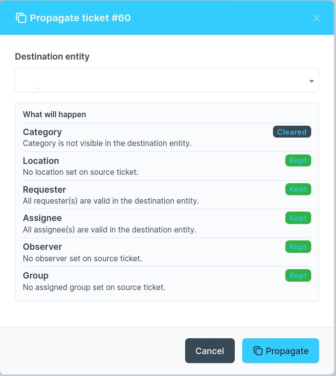

# Clone Ticket : Plugin GLPI

Ce plugin permet d'envoyer un ticket GLPI vers une autre entité en un clic, sans traîner avec lui une catégorie, un technicien ou une localisation qui n'a plus de sens une fois le ticket arrivé ailleurs.



## Pourquoi ce plugin existe

Si vous exploitez GLPI sur plusieurs entités (un MSP avec une entité par client, ou une grande organisation découpée en services), vous avez probablement déjà eu besoin de copier un ticket d'une entité vers une autre. La solution évidente consiste à cloner la ligne et à changer `entities_id`. Le problème, c'est qu'un ticket parfaitement valide dans l'entité A peut référencer des éléments qui n'existent pas, ou qui ne devraient pas être visibles, dans l'entité B : un arbre de catégories propre à A, un technicien qui n'a aucun droit dans B, une localisation qui n'a de sens que dans A.

Ce plugin vérifie chacune de ces références par rapport à l'entité de destination avant de créer le nouveau ticket, au lieu de les copier aveuglément. Si une valeur est réellement valide là-bas (parce qu'elle est partagée, ou récursive depuis une entité parente visible des deux côtés), elle est conservée. Si ce n'est pas le cas, elle est simplement omise, et le ticket de destination est créé sans elle plutôt que de pointer vers quelque chose de cassé.

## Ce que fait le plugin

- Ajoute un bouton « Propager vers une entité » sur chaque formulaire de ticket.
- Ouvre une fenêtre modale où vous choisissez l'entité de destination.
- Affiche un aperçu de ce qui va se passer dès que vous choisissez une entité : catégorie, localisation, demandeur, attribué, observateur et groupe, chacun marqué comme conservé ou effacé avec la raison, avant que vous validiez quoi que ce soit.
- Crée le ticket dans l'entité de destination via le circuit normal de création de ticket de GLPI, de sorte que les règles propres à cette entité (attribution de SLA, règles métier, etc.) s'appliquent au lieu d'être court-circuitées.
- Vérifie la catégorie, la localisation, le demandeur, l'attribué, l'observateur et le groupe assigné par rapport à l'entité de destination avant de décider de les conserver ou non.
- Relie à nouveau les éléments liés au ticket, mais uniquement ceux réellement visibles depuis l'entité de destination.
- Relie le nouveau ticket à l'original, afin de garder une trace de son origine.
- Gère les nouvelles tentatives en toute sécurité. Si une requête expire et que vous cliquez de nouveau, vous ne vous retrouverez pas avec deux tickets.

## Prérequis

| Prérequis | Version                                 |
|-----------|-----------------------------------------|
| GLPI      | 11.0 ou supérieur, avant 12.0           |
| PHP       | Selon les exigences de GLPI 11 lui-même |

Aucune extension PHP supplémentaire n'est nécessaire. Cette version ajoute une table en base de données pour son propre historique de propagation (voir plus bas) ; elle est créée automatiquement à l'installation et supprimée à la désinstallation.

## Installation

1. Téléchargez ou clonez ce dépôt dans `<RACINE_GLPI>/plugins/clone/`.
2. Rendez-vous dans Configuration > Plugins dans GLPI.
3. Repérez « Clone Ticket » puis cliquez sur Installer, puis Activer.

```bash
cd /var/www/glpi/plugins
git clone https://github.com/jturazzi/clone_glpi clone
```

## Utilisation

1. Ouvrez un ticket existant.
2. Cliquez sur « Propager vers une entité » (visible par les superviseurs et super-administrateurs).
3. Choisissez l'entité de destination dans le menu déroulant. Un aperçu apparaît, indiquant ce qui sera conservé, ce qui ne le sera pas, et pourquoi.
4. Cliquez sur Propager. Le plugin crée le ticket et vous fournit un lien vers celui-ci.

Si une catégorie, une localisation, un technicien, un demandeur, un observateur ou un groupe du ticket d'origine ne s'applique pas dans l'entité de destination, il est simplement omis du nouveau ticket plutôt que reporté à tort. C'est exactement ce que vous indique l'aperçu de l'étape 3 avant validation. Le nouveau ticket conserve un lien vers celui dont il provient, afin de pouvoir le retracer par la suite.

## Permissions

Le bouton n'apparaît que pour les utilisateurs disposant d'au moins l'un de ces droits :

- Ticket → Attribuer (superviseurs)
- Configuration → Mettre à jour (super-administrateurs)

L'accès à l'entité de destination elle-même est revérifié côté serveur, quel que soit ce qu'affiche le menu déroulant.

## Comment la propagation décide ce qu'elle conserve

Rien n'est copié sur le nouveau ticket au seul motif que le même identifiant en base existe dans les deux entités. Chaque champ propre à une entité est vérifié avant la création du ticket :

- **Catégorie et localisation** sont conservées si elles sont visibles depuis l'entité de destination, directement ou par récursivité depuis une entité parente. Effacées sinon.
- **Demandeur, attribué et observateur** sont conservés si cette personne a effectivement une présence dans l'entité de destination (et, pour l'attribué en particulier, les droits nécessaires là-bas).
- **Groupe assigné** est vérifié de la même façon, par rapport à l'entité de destination.
- **Éléments liés** (ordinateurs, téléphones, etc.) ne sont reliés à nouveau que si l'élément lui-même est visible depuis l'entité de destination. Un élément appartenant à l'entité d'un client n'est pas rattaché à un ticket situé dans l'entité d'un autre client.
- **Le SLA et la priorité ne sont volontairement pas copiés.** Le ticket est créé via le `Ticket::add()` normal de GLPI, de sorte que ce sont les règles métier propres à l'entité de destination qui déterminent ces valeurs, exactement comme pour n'importe quel ticket créé directement là-bas.

## Nouvelles tentatives en toute sécurité

Si une requête de propagation expire ou que la connexion est coupée avant que vous ne voyiez de résultat, cliquer de nouveau sur le bouton ne créera pas un second ticket. Le navigateur mémorise une tentative en cours, par ticket et par entité de destination, pendant environ trente minutes, et le serveur reconnaît une tentative répétée comme étant la même au lieu de repartir de zéro. Choisir une entité de destination différente, ou attendre plus longtemps que ce délai, est traité comme une nouvelle tentative.

## Arborescence des fichiers

```text
clone/
├── hook.php                            # Hooks d'installation/désinstallation & hook POST_ITEM_FORM
├── setup.php                           # Enregistrement du plugin (version, hooks, assets)
├── phpunit.xml                         # Configuration des tests (à exécuter depuis un checkout GLPI de dev)
├── ajax/
│   ├── clone_ticket.php                # Point d'entrée AJAX, exécute la propagation
│   ├── get_entity_dropdown.php         # Point d'entrée AJAX, retourne le <select> d'entités
│   └── preview_propagation.php         # Point d'entrée AJAX, aperçu en lecture seule de ce qui va se passer
├── src/                                # Moteur de propagation (PSR-4, GlpiPlugin\Clone\*)
│   ├── PropagationRequest.php          # Une demande de propagation : ticket source + entité de destination
│   ├── PropagationPreflightService.php # Décide ce qui est conservé ou effacé, champ par champ
│   ├── PropagationPlan.php             # La décision, champ par champ
│   ├── PropagationExecutor.php         # Crée le ticket, le relie, enregistre le résultat
│   ├── PropagationLedgerRepository.php # Lit et écrit la table d'historique de propagation
│   ├── PropagationError.php            # Codes d'erreur affichés aux administrateurs
│   ├── EntityScopedItemVisibility.php  # Vérification partagée de visibilité catégorie/localisation/groupe
│   ├── TicketActors.php                # Lit les demandeurs/attribués/observateurs/groupes d'un ticket
│   ├── Uuid.php                        # Génération et validation d'UUID
│   └── Actor/                          # Vérifications d'éligibilité par rôle
│       ├── AssigneeValidator.php
│       ├── RequesterValidator.php
│       ├── ObserverValidator.php
│       └── GroupValidator.php
├── tests/
│   ├── PropagationPreflightServiceTest.php
│   └── PropagationExecutorTest.php
├── locales/
│   ├── en_GB.po                        # Traductions anglaises
│   └── fr_FR.po                        # Traductions françaises
└── public/
    ├── css/
    │   └── clone.css                   # Styles du bouton & de la modale
    └── js/
        └── clone.js                    # Logique côté client (modale, fetch, Select2, sécurité des tentatives)
```

## Traductions

Le plugin est livré avec les locales anglaise (`en_GB`) et française (`fr_FR`). Pour ajouter une nouvelle langue, créez le fichier `.po` correspondant dans `locales/` et compilez-le en `.mo` avec `msgfmt` :

```bash
msgfmt locales/fr_FR.po -o locales/fr_FR.mo
```

## Exécuter les tests

Les tests présents dans `tests/` sont écrits selon les conventions de test propres à GLPI (`Glpi\Tests\DbTestCase`) et nécessitent un véritable checkout de GLPI 11 pour s'exécuter, avec ce plugin installé dans `plugins/clone/` et une base de données de test configurée :

```bash
phpunit --configuration plugins/clone/phpunit.xml
```

## Licence

Ce plugin est distribué sous la [licence MIT](LICENSE).

## Auteur

**Jérémy TURAZZI**

## Contributeurs

**Mohammed GHOUSE**

- Remplacement du clonage brut par le moteur de propagation sensible aux entités (vérification de la catégorie, de la localisation, du demandeur, de l'attribué, de l'observateur et du groupe par rapport à l'entité de destination ; création via `Ticket::add()` ; liaison source/destination ; historique de propagation avec gestion des tentatives idempotente).
- Ajout de l'aperçu de propagation affiché dans la modale dès la sélection de l'entité de destination, avant la création du ticket.
- Synchronisation des catalogues de traduction avec les chaînes renommées et ajoutées.
